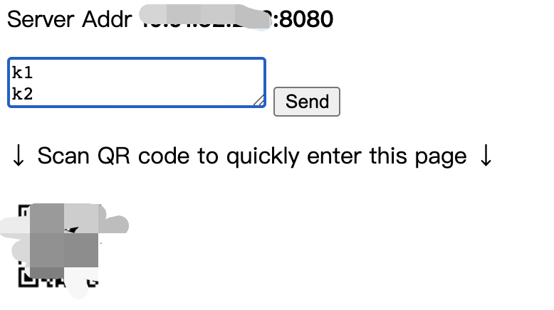

# K Text Forward Guy

Forward text easily and quickly.

## What's this

Developers who test mobile application need forward some text to pc, and sometimes, 
it's **NOT** convenient to open some IM app to forward by sending text to yourself,
especially the mobile is not yours.

So I made this. A simple server returns a simple web page, 
and handles text by printing it to console stdout.

## Environment

- Python 3

## How to run

```shell script
python main.py
```

This will run a server listening ip (your **local** ip):port (8080 by default).

Console output format: 

```
Starting server, listening http://[IP]:8080 use <Ctrl-C> to stop
```

Then visit that site, there will be a simple page including:

- `input` the text what you need to forward

- `button` click to forward to server

- `qrcode` scan to quickly enter site

Easy to understand, right?

## Web Page Preview



## Security

The server is running in LAN by default, so anyone in the same LAN can access its service.
To avoid being attacked, **STOP server in time while you don't need it**.

## Thanks

QRCode by [kazuhikoarase/qrcode-generator](https://github.com/kazuhikoarase/qrcode-generator/)